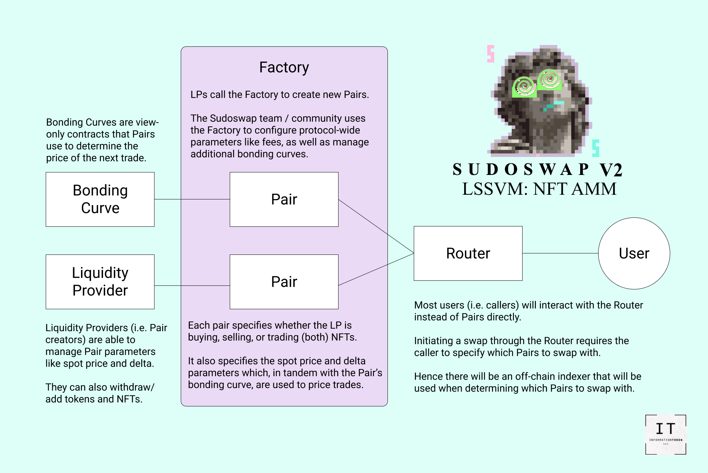

# beaconAMM-v1

First version of the BeaconAMM. Forked from [sudoswap](https://github.com/sudoswap/lssvm/tree/9e8ee80f60682b8f3f73163f1870ff28f7e07668).

Liquidity providers use `BeaconAmmV1PairFactory` to deploy a modified minimal proxy `BeaconAmmV1Pair` for a specific NFT collection. From there, the deployed pool maintains its own TOKEN/NFT inventory. Users can then call the various `swap` functions on the pool to trade TOKEN/NFTs.

`BeaconAmmV1Pair`s are either `BeaconAmmV1PairEnumerable` or `BeaconAmmV1PairMissingEnumerable` depending on whether or not the pair's `ERC721` contract supports `Enumerable` or not. If it doesn't, we implement our own ID set to allow for easy access to NFT IDs in the pool.

For the actual token, NFTs are paired either with an `ERC20` or `ETH`, so there are 4 types of pairs:

* Missing Enumerable | ETH
* Missing Enumerable | ERC20
* Enumerable | ETH
* Enumerable | ERC20

The `BeaconAmmV1Router` allows splitting swaps across multiple `BeaconAmmV1Pair`s to purchase and sell multiple NFTs in one call.

An `BeaconAmmV1Pair` can be TOKEN, NFT, or TRADE.
The type refers to what the pool holds:
- a TOKEN pool has tokens that it is willing to give to traders in exchange for NFTs
- an NFT pool has NFTs that it is willing to give to traders in exchange for tokens
- a TRADE pools allow for both TOKEN-->NFT and NFT-->TOKEN swaps.

The `BeaconAmmV1Pair` `swap` functions are named from the perspective of the end user. EX: `swapTokenForAnyNFTs` means the caller is sending ETH and receiving NFTs.

In order to determine how many NFTs or tokens to give or receive, each `BeaconAmmV1Pair` calls a discrete bonding curve contract that conforms to the `ICurve` interface. Bonding curve contracts are intended to be pure; it is the responsibility of `BeaconAmmV1Pair` to update its state and perform input/output validation.

See inline comments for more on swap/bonding curve logic.

### Architecture

See the diagram below for a high-level overview, credits go to [IT DAO](https://twitter.com/InfoTokenDAO):



### Testing
To help with code reuse, `base` contains actual swap logic to be tested in the form of abstract contracts, while actual test files inherit from various parent contracts found in `mixins` to implement the different choices of bonding curve, NFT, or token.

`testgen-scripts` contains a Python script used to generate all combinations of bonding curve, NFT, and token for each test in `base`. They are then placed into `test-cases`, which are the actual test files that get run.

Test files are prefixed with a shortened name of the base test they implememnt (e.g. NoArb for NoArbBondingCurve), which is then followed by the specific bonding curve type, then NFT type, then token type, e.g. `NoArbLinearMissingEnumerableETH`.

Our testing setup is compatible with both `forge` and `dapptools`. We recommend `forge` as it is significantly faster to run.

---

# Built with DappTools Template

## Building and testing

```sh
make
make test
```

## Deploying

Contracts can be deployed via the `make deploy` command. Addresses are automatically
written in a name-address json file stored under `out/addresses.json`.

We recommend testing your deployments and provide an example under [`scripts/test-deploy.sh`](./scripts/test-deploy.sh)
which will launch a local testnet, deploy the contracts, and do some sanity checks.

Environment variables under the `.env` file are automatically loaded (see [`.env.example`](./.env.example)).
Be careful of the [precedence in which env vars are read](https://github.com/dapphub/dapptools/tree/2cf441052489625f8635bc69eb4842f0124f08e4/src/dapp#precedence).

We assume `ETH_FROM` is an address you own and is part of your keystore.
If not, use `ethsign import` to import your private key.

We use Infura as a remote node provider for the Mainnet & Rinkeby network deployments.
You must have set your API key as the `INFURA_API_KEY` enviroment variable in order to
deploy to these networks

## Deployments

### Goerli

"BeaconAmmV1PairEnumerableETH": "0x7DDaF116889D655D1c486bEB95017a8211265d29",
"BeaconAmmV1PairMissingEnumerableETH": "0x17C83E2B96ACfb5190d63F5E46d93c107eC0b514",
"BeaconAmmV1PairEnumerableERC20": "0x5008F837883EA9a07271a1b5eB0658404F5a9610",
"BeaconAmmV1PairMissingEnumerableERC20": "0xfb91c019D9F12A0f9c23B4762fa64A34F8daDb4A",
"BeaconAmmV1PairFactory": "0xA0B9915CE86a0082F5ee11478218B3fe71CdceCe",
"BeaconAmmV1Router": "0xaC601526BD17742e04FF15d7D4EB89612626Ff6a",
"ExponentialCurve": "0xC1B5D52b6459Dd02263F2C8469244a8a71D163F2",
"LinearCurve": "0x531b20602B19ebeB77996aeBAdDD210B3c2916AC"
